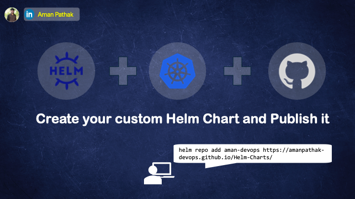

# 🎯 Custom Helm Charts for Kubernetes Applications

[](https://www.linkedin.com/in/aman-devops/)
[](https://discord.com/invite/jdzF8kTtw2)
[](https://medium.com/@amanpathakdevops)
[](https://github.com/AmanPathak-DevOps)
[](https://kubernetes.io/)
[](https://github.com/AmanPathak-DevOps/Helm-Charts/blob/main/LICENSE)
[](#comprehensive-guide)


## 🚀 Introduction

This repository contains custom Helm charts for deploying and managing your Kubernetes applications. Helm simplifies Kubernetes deployments by packaging and automating application setup, allowing developers and teams to ship applications with greater speed and reliability.

These custom charts provide flexibility for advanced configurations, multiple environment support, and scalability in cloud-native environments. Whether you're deploying microservices, databases, or any other apps in your Kubernetes cluster, these Helm charts will serve as reusable templates.

## 🎯 Objective

The main goal of this project is to:
- **Create Custom Helm Charts** tailored for Kubernetes applications.
- **Package and Publish** Helm charts on GitHub Pages for public or private use.
- **Enable Reusability** by providing easily configurable Helm charts to simplify future deployments.

## 📘 Comprehensive Guide

For a complete step-by-step guide on how to create, package, and publish your Helm charts, refer to my detailed guide on Medium:  
🔗 [Comprehensive Guide on Medium](https://amanpathakdevops.medium.com/how-to-package-and-publish-your-custom-helm-charts-a-hands-on-tutorial-c922c54f94a4)

This guide will walk you through:
- Setting up Helm charts from scratch.
- Structuring and organizing your Helm repository.
- Publishing your charts to GitHub Pages for easy reuse.
  
## 🚀 Getting Started

To install one of the Helm charts from this repository, you can add the Helm repo and install the chart as follows:

```bash
# Add the repository
helm repo add <repo_name> <repo_url>

# Install a chart
helm install <release_name> <repo_name>/<chart_name>
```

## 🌟 Features

- Customizable Values: Modify configurations via values.yaml to suit different environments.
- CI/CD Ready: Easily integrate with CI/CD pipelines for automated deployments.
- GitHub Pages Hosting: Host your Helm repository for public or private consumption.

## 📄 License
This project is licensed under the [MIT License](LICENSE).

Keep Learning! 🚀